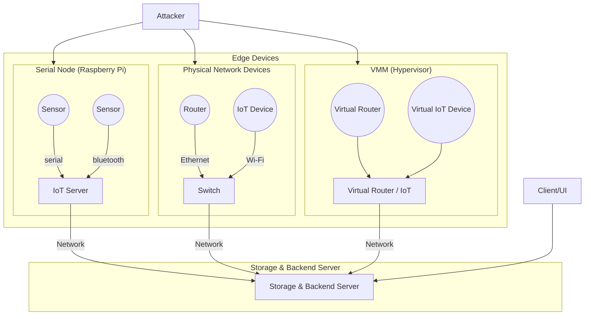

```mermaid
flowchart TB
    ATTACKER["Attacker"]

    subgraph EDGE["Edge Devices"]
        subgraph SERIAL["Serial Node (Raspberry Pi)"]
        SERIAL_S1((Sensor)) -- "serial" --> SERIAL_NODE[IoT Server]
        SERIAL_S2((Sensor)) -- "bluetooth" --> SERIAL_NODE
        end

        subgraph PHY_NET["Physical Network Devices"]
        EDGE_S1((Router)) --"Ethernet"--> EDGE_NODE[Switch]
        EDGE_S2((IoT Device)) --"Wi-Fi"--> EDGE_NODE
        end

        subgraph VMM["VMM (Hypervisor)"]
        VMM_S1((Virtual Router)) --> VMM_NODE[Virtual Router / IoT]
        VMM_S2((Virtual IoT Device)) --> VMM_NODE
        end
    end

    ATTACKER --> PHY_NET
    ATTACKER --> SERIAL
    ATTACKER --> VMM

    %% Data flows to storage
    SERIAL_NODE -- "Network" --> STORAGE[Storage & Backend Server]
    EDGE_NODE -- "Network" --> STORAGE
    VMM_NODE -- "Network" --> STORAGE

    %% Storage & backend services
    subgraph STORAGE_SVR["Storage & Backend Server"]
        STORAGE
    end

    CLIENT["Client/UI"] --> STORAGE
```
