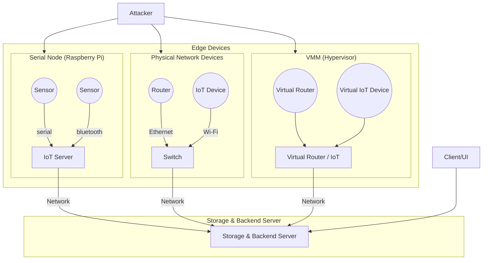

### Types of data collected

-   Temperature
-   Humidity
-   Pressure
-   Light intensity
-   CO2 levels
-   PCap

## 1. Serial Node

-   Would a Raspberry Pi onto which we connect serial devices and aggregate data from `bluetooth` devices and sensors that use `UART` and `I2C`
-   After getting a sensor read, we send it to the backend server via the network

## 2.1 Backend server

-   Can be written in Typescript + Zod (schema validation) `OR` Python
-   Exposes A `REST` API to receive data from edge devices
-   Stores the data received
-   Exposes an API to query data stored

#### Example API

```
/api/sensor
JSON payload with {sensor_id, timestamp, value}[] at interval t
```

```
/api/pcap
Pcap for a period time from the hotspot switch
```

```
/api/health
JSON payload with {device_ip, timestamp, status{OK|UNREACHABLE}}[] at interval t
```

## 2.2 Storage engine

-   [Object storage](https://aws.amazon.com/what-is/object-storage/)
-   Storing
    1.  Pcaps
    2.  Log files

```log
# serial_log_2024-10-01T12.log
2024-10-01T12:00:00Z SENSOR_ID_1 23.5
2024-10-01T12:00:00Z SENSOR_ID_2 45.2
2024-10-01T12:00:00Z SENSOR_ID_3 1013.1
2024-10-01T12:00:00Z SENSOR_ID_4 400
```

3. `Device Health status` - ping devices connected to hotspot and report availability

## 2.3 User Interface (UI)

-   Dashboard to visualize data
-   Load sensor log file and plot it
-   `COTS`(commercially available off-the-shelf ) vs `Custom`
    -   `COTS`:
        -   [Kibana](https://www.elastic.co/kibana)
        -   [Graphana](https://grafana.com/)
    -   `Custom`: React frontend

### 3. Attacker

-   After colllecting data from the setup for a reasonable amount of time to establish a baseline. A malicious device will be introduced in the network to attack edge devices using known exploits.

Types of attacks being simulated:

1. DDoS/DoS
2. Recon/Fingerprinting

## BOM (Bill of Materials)

### Perfect scenario

1. Raspberry Pi (IoT Server)
1. 3 computers
    1. Run Virtual devices e.g vulnerable routers
    2. Run Backend server
    3. Hotspot - to which all networked devices connect through. This will allow us to sniff traffic and collect traffic data
        - https://suricata.io/

### Budget scenario

1. Raspberry Pi (IoT Server)
2. 1 computer
    1. Run Backend server
    1. Run Virtual devices at the cost of performance
    1. Act as a hotspot to other devices in order to sniff packets and traffic

## Available devices

#### Serial devices

1. [Arduino Compatible Digital Light Sensor (BH1750FVI)](https://www.pishop.ca/product/arduino-compatible-digital-light-sensor-bh1750fvi/)
2. [Adafruit BME680 - Temperature, Humidity, Pressure and Gas Sensor
   ](https://www.pishop.ca/product/adafruit-bme680-temperature-humidity-pressure-and-gas-sensor/)
3. [MH-Z19 Infrared CO2 Sensor](https://www.amazon.ca/Infrared-Monitor-Dioxide-MH-Z19B-0-5000PPM/dp/B07KDPDH76)

#### Bluetooth devices

1. [nRF52840 Dongle
   ](https://www.nordicsemi.com/Products/Development-hardware/nRF52840-Dongle)
1. [nRF52840 DK](https://www.nordicsemi.com/Products/Development-hardware/nRF52840-DK)

#### Ethernet devices

1. [Hue Bridge](https://www.philips-hue.com/en-ca/p/hue-bridge/046677458478#overview) - Used to control other IoT devices e.g Smart lamps, cameras

### WiFi devices

1. [EFR32xG24 Pro Kit](https://www.silabs.com/development-tools/wireless/efr32xg24-pro-kit-10-dbm?tab=overview)
1. Routers (Virtual)
