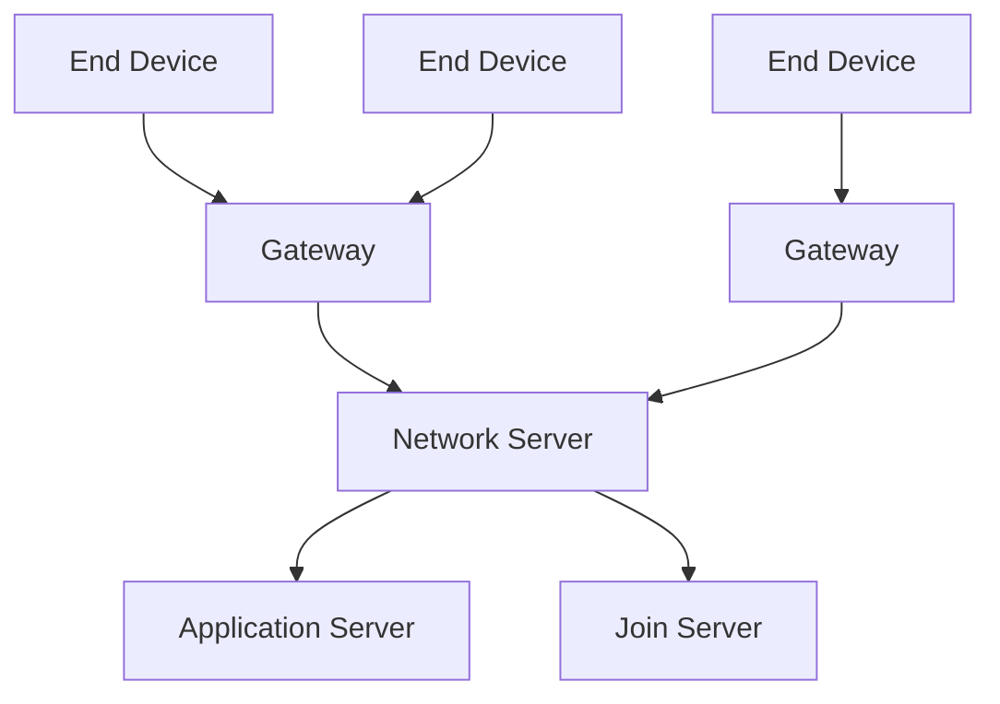
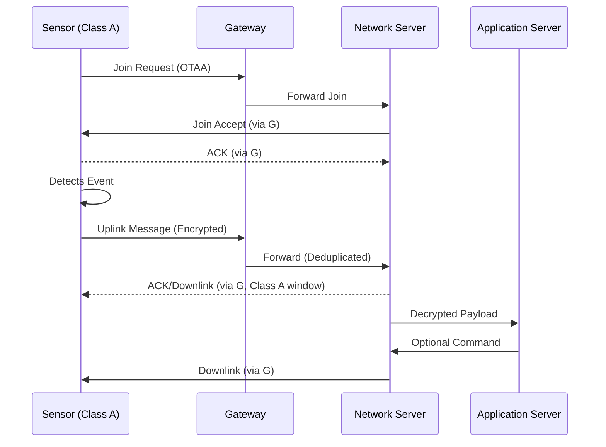

# LoRaWAN Protocol

## Introduction

LoRaWAN is a low-power, wide-area networking protocol for IoT devices, enabling long-range, battery-efficient communication in sub-GHz bands. It supports large-scale deployments for smart metering, agriculture, and tracking, with built-in security and adaptive rates.

Developed in 2015 by the LoRa Alliance (Semtech, IBM, Actility, Kerlink), it uses Semtech's LoRa CSS modulation for global interoperability.

## Core Concepts

### Star-of-Stars Topology

LoRaWAN employs a star topology: end devices send to gateways, which relay to a network server for deduplication and routing. Gateways provide wide coverage (up to 15 km rural) without meshing, minimizing device power use.

## Architecture

LoRaWAN spans PHY, MAC, network, and application layers with integrated AES-128 security.

-   **PHY Layer (LoRa):** CSS modulation in sub-GHz (e.g., 868 MHz EU); spreading factors for 0.3-50 kbps.

-   **MAC Layer:** ALOHA access, confirmed messages, ADR, device classes.

-   **Network Layer (Regional):** Addressing (DevEUI, AppEUI), activation (OTAA/ABP), routing.

-   **Application Layer:** Payload handling (e.g., LwM2M).

### Device Types

-   `End Devices` (Classes A/B/C): Sensors; Class A (uplink-first bidirectional), Class B (scheduled downlinks), Class C (continuous receive).

-   `Gateways`: IP-bridging receivers; no protocol logic.

-   `Network Server`: Manages auth, keys, routing.

Asymmetric (uplink-heavy); confirmed ACKs, duty cycle limits, replay protection via counters.

## Example: Simple Sensor Network

## Glossary

-   **ABP**: Activation By Personalization – Pre-configured device keys for simpler, less secure activation.
-   **ADR**: Adaptive Data Rate – Dynamically adjusts modulation to optimize range/battery.
-   **AES**: Advanced Encryption Standard – 128-bit encryption for security.
-   **CSS**: Chirp Spread Spectrum – Modulation technique for robust, long-range LoRa signals.
-   **DevEUI**: Device Extended Unique Identifier – Global device ID.
-   **IoT**: Internet of Things – Network of connected devices.
-   **LwM2M**: Lightweight Machine to Machine – Application protocol for device management.
-   **MAC**: Media Access Control – Layer for channel access and framing.
-   **OTAA**: Over-The-Air Activation – Secure, dynamic key derivation on join.
-   **PHY**: Physical Layer – Handles signal transmission/reception.

## References

-   https://en.wikipedia.org/wiki/LoRa
-   https://lora-alliance.org/resource_hub/lorawan-specification-v1-0-4/
-   https://resources.lora-alliance.org/home
