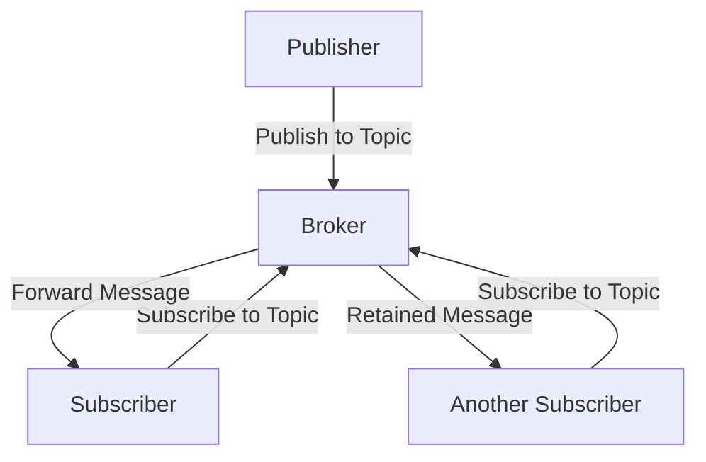
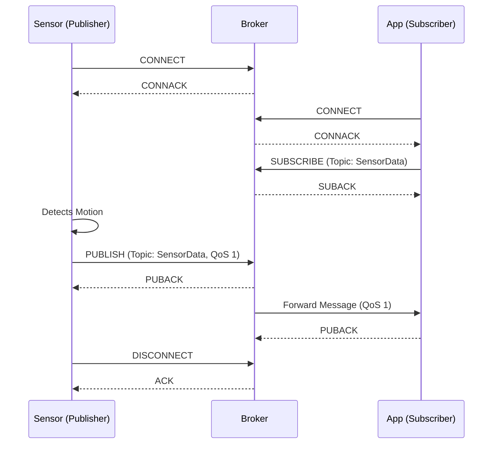

# MQTT Protocol

## Introduction

MQTT is a lightweight, publish-subscribe messaging protocol for the Internet of Things (IoT), designed for resource-constrained devices and low-bandwidth, high-latency networks. It enables efficient, bi-directional communication in machine-to-machine scenarios, running over `TCP/IP` as an OASIS standard (ISO/IEC 20922).

Developed in 1999 by Andy Stanford-Clark (IBM) and Arlen Nipper (Eurotech) for monitoring oil pipelines via satellite, it has evolved through versions 3.1 (2010), 3.1.1 (2014), and 5.0 (2019), with features like enhanced security and message expiry.

## Core Concepts

### Publish-Subscribe Model

MQTT uses a broker-mediated pub-sub pattern where publishers send messages to hierarchical topics without knowing subscribers, and the broker routes them efficiently. This decouples senders and receivers, supports scalability, and handles retained messages for late-joining subscribers.

## Architecture

MQTT operates as an application-layer protocol atop TCP/IP, with a central broker managing connections, topics, and routing for multiple clients.

-   **Application Layer (MQTT):** Handles CONNECT, PUBLISH, SUBSCRIBE, and DISCONNECT; supports topic hierarchies and QoS.

-   **Transport Layer (TCP):** Ensures ordered, lossless delivery; ports 1883 (unencrypted) and 8883 (TLS).

-   **Internet Layer (IP):** Provides addressing and routing.

-   **Link and Physical Layers:** Network-specific, e.g., Ethernet or Wi-Fi.

### Roles

-   `Broker`: Central server that authenticates clients, routes messages by topic, and manages sessions; supports clustering for scalability.

-   `Publishers`: Clients that send data to topics (e.g., sensors publishing readings).

-   `Subscribers`: Clients that receive messages matching subscribed topics (e.g., apps displaying data).

Communication is bi-directional with persistent sessions; QoS ensures delivery: 0 (at most once), 1 (at least once), 2 (exactly once). Security uses TLS, username/password, or certificates.

### What Are Retained Messages in MQTT?

In MQTT, a retained message is a special type of PUBLISH message where the publisher sets the "retain" flag to true in the message header. When the broker receives this, it stores the message (payload and properties) persistently for that specific topic, overwriting any previous retained message for the same topic. This ensures that the most recent "state" or value for the topic is always available.

##### How It Works

-   `Storage on the Broker`: The broker keeps only the last retained message per topic. It's not tied to client sessions, so it persists even if the publishing client disconnects.

-   `Delivery to New Subscribers`: When a client subscribes to a topic (via a SUBSCRIBE message), the broker immediately delivers the retained message to that client, if one exists. This happens before any new publishes, giving the subscriber the current state without waiting for an update.
-   `Clearing Retained Messages`: To remove a retained message, publish an empty payload (zero bytes) to the same topic with the retain flag set to true. This acts as a "clear" signal, ensuring no message is sent to future subscribers.
-   `Quality of Service (QoS)`: Retained messages are delivered at the QoS level specified in the original PUBLISH, but the subscription's QoS can influence handling (e.g., the broker may downgrade if needed).

##### Example Use Case

Imagine a temperature sensor publishing readings to the topic `home/livingroom/temperature`. If it sends `23°C` with retain=true, the broker stores it. Later, a new mobile app subscribes to the topic—even if the sensor hasn't published in hours—the app instantly receives `23°C` as the current value, providing immediate context.

## Example: Simple Sensor Network

## References

-   https://en.wikipedia.org/wiki/MQTT
-   https://mqtt.org/
-   https://docs.oasis-open.org/mqtt/mqtt/v5.0/mqtt-v5.0.html
