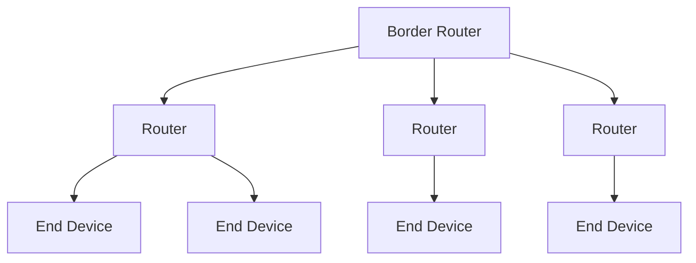
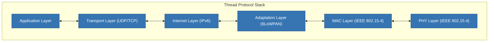
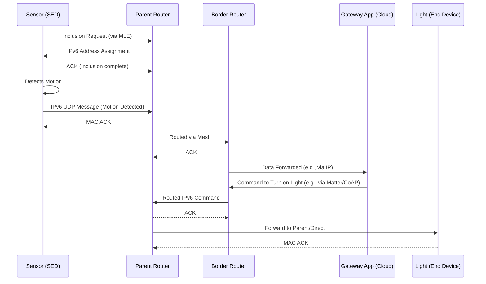

# Thread Protocol

## Introduction

Thread is an IPv6-based, low-power mesh networking protocol for IoT devices in smart homes and building automation. It enables interoperable communication across manufacturers, building on IEEE 802.15.4 and 6LoWPAN for reliable, secure connectivity.

Formed in 2014 by the Thread Group (initially Nest Labs, Samsung, ARM; now including Apple, Amazon, IKEA), it supports Matter integration and operates in the 2.4 GHz band for low-power, scalable networks up to thousands of nodes.

## Core Concepts

### Mesh Networking

Thread uses a self-forming, self-healing mesh where devices relay messages to extend range and reliability. It supports up to 32 active routers for multi-hop routing.

## Architecture

Thread's IP-based stack includes:

-   **PHY and MAC Layers:** IEEE 802.15.4 at 250 kbps; handles transmission, CSMA-CA, ACKs, retries, AES encryption.

-   **Adaptation Layer (6LoWPAN):** IPv6 header compression, fragmentation, mesh routing.

-   **Internet Layer (IPv6):** Addressing, routing, ICMPv6.

-   **Transport Layer (UDP/TCP):** Low-overhead delivery.

-   **Application Layer:** Protocols like CoAP for device tasks.

### Device Types

-   `Border Router`: Bridges Thread to IP networks (e.g., Wi-Fi); required for external access.

-   `Routers` (FTDs): Backbone for routing, addressing; up to 32 active.

-   `End Devices` (MTDs/SEDs): Low-power peripherals; rely on parent routers.

Communication uses two-way ACKs, retries (3-4 attempts), and ICMPv6 error reporting. A Leader router manages keys and partitions.

## Example: Simple Sensor Network

## References

-   https://en.wikipedia.org/wiki/Thread_(network_protocol)
-   https://www.threadgroup.org/Portals/0/documents/support/Thread%20Network%20Fundamentals_v3.pdf
-   https://openthread.io/guides/thread-primer
