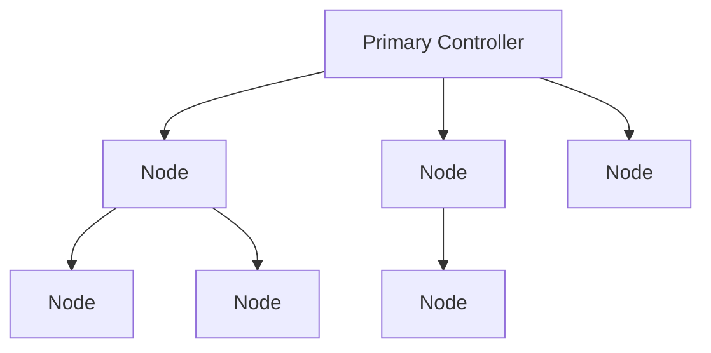
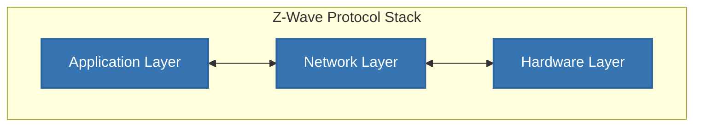
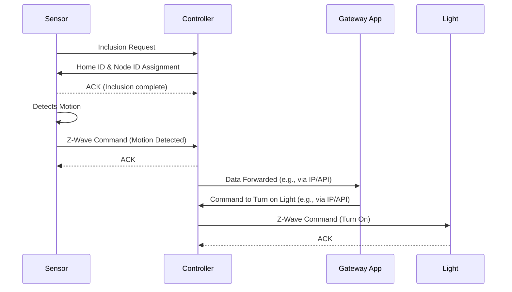

# Z-Wave Protocol

## Introduction

Z-Wave is a wireless communication protocol primarily designed for smart home and commercial building automation. It enables devices from different manufacturers to communicate with each other, creating an interoperable ecosystem for the Internet of Things (IoT).

It was developed in 1999 by a Danish company called Zensys, Z-Wave operates on low-energy radio waves, making it an efficient choice for battery-powered devices. The technology is now owned by Silicon Labs and is supported by the Z-Wave Alliance, which includes over 300 companies.

Z-wave allows your smart lights, thermostats, security sensors, and door locks to understand and respond to each other, creating a cohesive and intelligent home environment.

## Core Concepts

### Mesh Networking

Z-Wave devices can relay signals to one another. This creates a resilient and reliable network. If a direct path between two devices is blocked, the signal can find an alternative route through other devices in the network. This extends the overall range of the network and eliminates single points of failure.

A Z-Wave network can support up to four "hops," meaning a signal can jump between up to four devices to reach its destination.

## Architecture

Z-Wave home automation technology comprises three primary layers. The radio layer, network layer, and application layer work together to create a robust and reliable network that enables numerous nodes and devices to communicate with each other simultaneously.

This layered architecture ensures that different functions of the protocol are separated, making the system modular and easier to manage.

-   **Radio Layer:** This is the lowest layer of the Z-Wave protocol. It defines the way a signal is exchanged between the network and the physical radio hardware. This includes critical parameters like the operating frequency (in the sub-1 GHz band), data encoding methods, and how the software accesses the radio transceiver.

-   **Network Layer:** This layer defines how control data is exchanged between two devices or nodes. Its responsibilities include network organization (assigning Home and Node IDs), message routing through the mesh network, and ensuring reliable message delivery with acknowledgments and retransmissions.

-   **Application Layer:** The highest layer of the stack defines which messages need to be handled by specific applications to accomplish particular tasks.

### Device Types

A Z-Wave network consists of two primary types of devices:

-   `Controller` – Controller is the administrator of a Z-Wave network. It sets up the network, knows all of its devices, and keeps track of them. It is the central point of your network where you can enable permissions and add new devices. Normally, a Z-Wave controller like Homey takes this role, and you need at least one of these devices per network. However, multiple controllers can be added to form a larger mesh.

-   `Routing nodes` know all their neighbors. They repeat the signal to extend its range so that other devices can connect from a distance. They can send unsolicited messages to all other nodes they can route to. Battery-operated sensors, smart plugs, thermostats usually take the role of the router.

-   `End nodes` occupy the most outward positions in a mesh, and while they know all their neighbors, they can communicate only with the node from which they receive messages. End nodes are usually powered devices, such as wall switches, dimmers, or blind controllers.

-   Communication between devices is `always two-way`: devices confirm commands given to them. This makes Z-Wave devices very reliable and ensures they don’t miss a command.

-   `Confirmation of Delivery`: When a Z-Wave device sends a command to another device, it expects to receive an acknowledgment in return. This ACK serves as a receipt, confirming that the message was successfully delivered to the intended recipient.

-   `Retransmission Attempts`: If the sending device does not receive an ACK within a certain timeframe, it assumes the message was lost. The protocol is designed to then automatically re-send the command. Typically, it will make up to `three attempts` to deliver the message before reporting a failure.

-   `Error Reporting`: If after multiple attempts the sender still does not receive an acknowledgment, it will report a failure. This allows the user or the smart home hub to be aware that a command was not successful.

### Example: Simple Sensor Network

### References

-   https://homey.app/en-ca/wiki/what-is-z-wave/
-   https://www.vesternet.com/en-global/pages/understanding-z-wave-networks-nodes-devices
