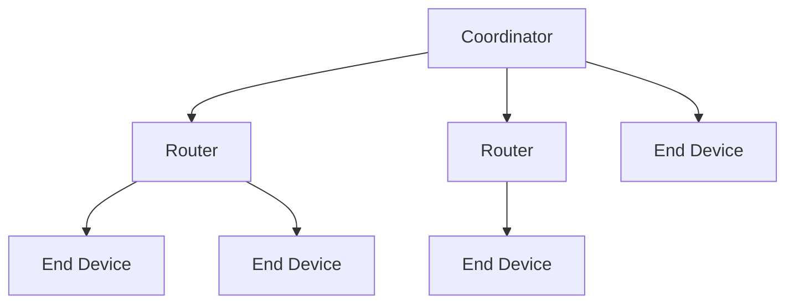
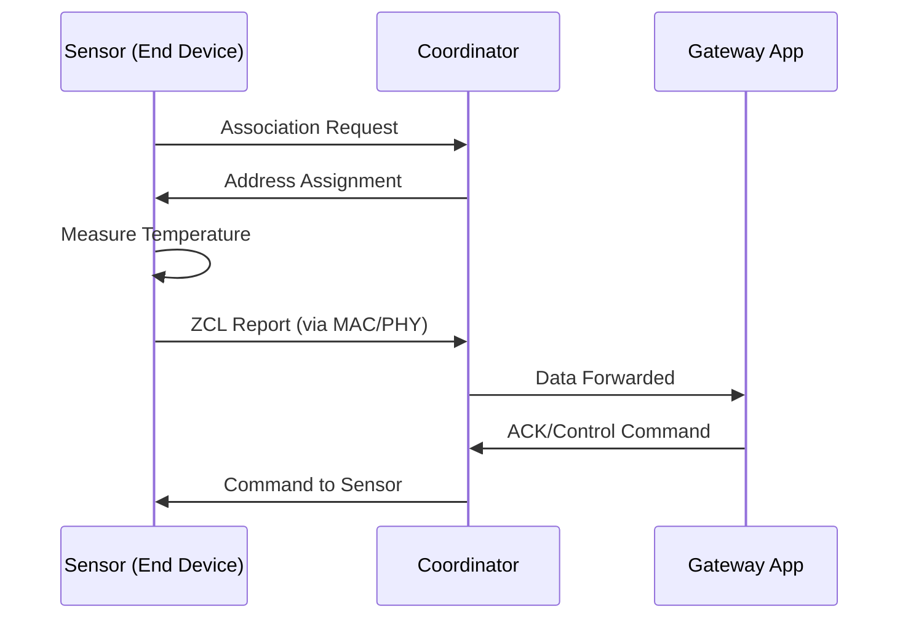

# Zigbee Protocol

## Introduction

Zigbee is a wireless communication protocol designed for low-power, low-data-rate applications, making it a perfect choice for smart homes and the Internet of Things (IoT). It's an open, global, packet-based protocol that provides a secure and reliable architecture for wireless networks.

Think of Zigbee as the language our smart devices use to talk to each other. It allows devices like light bulbs, thermostats, and sensors to communicate seamlessly, creating a robust and efficient network.

## Core Concepts

### Mesh Networking

At the heart of Zigbee is its mesh networking capability. Unlike traditional networks where each device connects directly to a central hub, Zigbee devices can relay data to each other. This creates a resilient and self-healing network. If one device fails, the data can find an alternative path to its destination.

### Device Types

A Zigbee network has three types of devices:

-   **Coordinator:** The `brain` of the network. It's responsible for starting the network and managing other devices. There is only one coordinator in each network.
-   **Router:** These are full-function devices that can route traffic from other devices. They are essential for extending the range of the network.
-   **End Device:** These are the simple, battery-powered devices like sensors and switches. They don't route traffic and spend most of their time in a low-power "sleep" mode to conserve energy, waking up only to transmit data.

## Architecture

The Zigbee protocol is built on top of the IEEE 802.15.4 standard, which defines the physical (PHY) and media access control (MAC) layers. Zigbee adds the network and application layers on top of this foundation.

-   **Physical (PHY) Layer:** This layer is responsible for the raw data transmission over the air.
    -   Zigbee uses radio frequency (RF) transmission as its physical means to send data, operating over unlicensed wireless spectrum bands such as 2.4 GHz (globally)
-   **Media Access Control (MAC) Layer:** It manages how devices access the wireless channel, using a mechanism called Carrier-Sense Multiple Access with Collision Avoidance (CSMA/CA).
-   **Network (NWK) Layer:** This is where the magic of mesh networking happens. It's responsible for routing, managing the network, and security.
-   **Application (APL) Layer:** This layer provides the framework for the actual applications running on the devices. It includes the Application Support Sub-layer (APS) and Zigbee Device Objects (ZDO).

## Key Features

-   **Low Power:** Zigbee is designed for low-power consumption, allowing battery-powered devices to last for years.
-   **Reliable and Robust:** The mesh topology of Zigbee networks eliminates single points of failure, ensuring reliable communication.
-   **Scalable:** Zigbee networks can support a large number of devices.
-   **Secure:** It uses AES-128 encryption to secure the network.

### Example: Simple sensor Network

### References

-   https://www.geeksforgeeks.org/computer-networks/introduction-of-zigbee/
